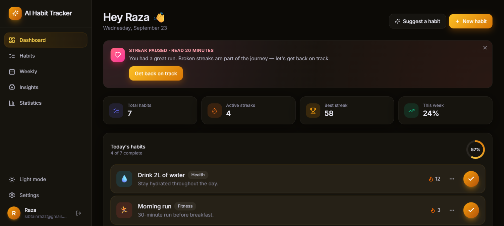
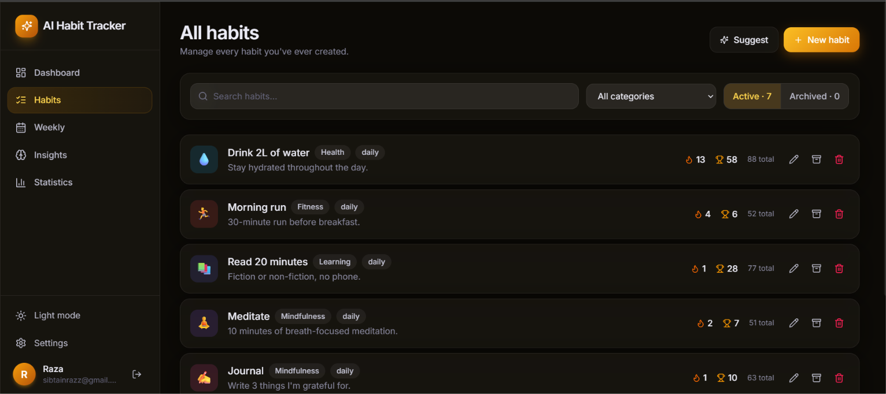
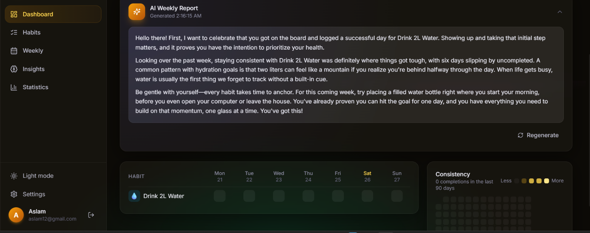
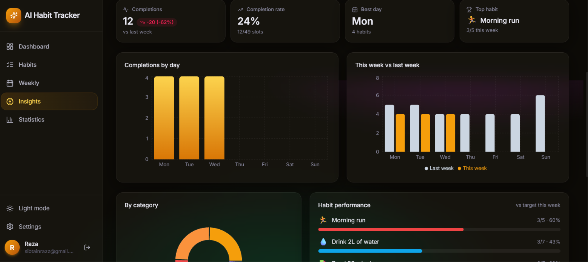
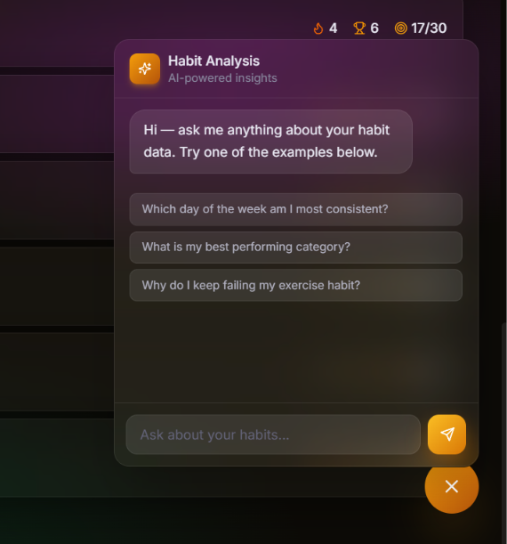
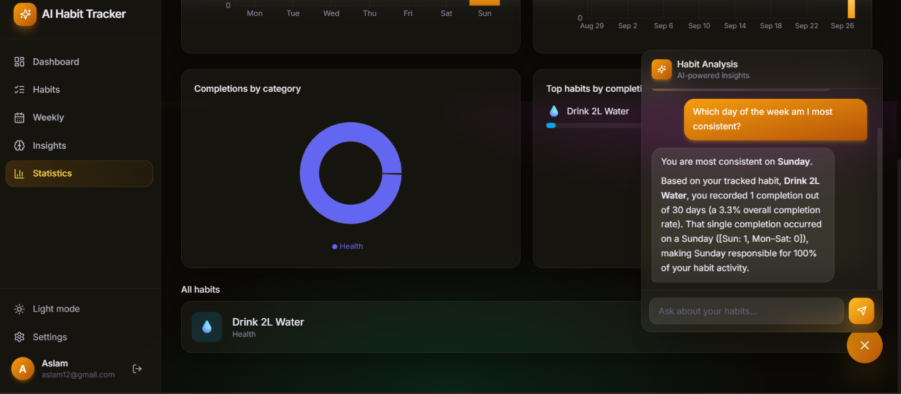

<<<<<<< HEAD
# 🔥 Habit Tracker — AI-Powered Habit Building App

A full-stack, end-to-end habit tracking application with a beautiful glassmorphism UI, streak tracking, GitHub-style heatmaps, and a suite of **Google Gemini-powered AI features** that act as your personal habit coach.

> Build habits that stick — with data, delight, and an AI coach in your corner.

---

## 📑 Table of Contents

- [Overview](#-overview)
- [Features](#-features)
- [Tech Stack](#-tech-stack)
- [Architecture](#-architecture)
- [Screenshots](#-screenshots)
- [Project Structure](#-project-structure)
- [Getting Started](#-getting-started)
- [Environment Variables](#-environment-variables)
- [API Overview](#-api-overview)
- [AI Features in Detail](#-ai-features-in-detail)
- [Security](#-security)
- [Deployment](#-deployment)
- [Roadmap](#-roadmap)
- [Contributing](#-contributing)
- [License](#-license)
- [Author](#-author)

---

## 🌟 Overview

Habit Tracker helps users create, track, and analyse daily habits.

It combines a simple check-off experience with meaningful analytics such as streaks, heatmaps, charts, and AI-driven coaching features including:

- Weekly AI reports
- AI habit suggestions
- Streak recovery plans
- Habit analysis chat
- Morning motivation

The application uses **Google Gemini** to analyse real habit data and provide personalised insights.

---

## ✨ Features

### 🔐 Core Features

| Feature | Description |
|---|---|
| **User Authentication** | JWT-based authentication with bcrypt password hashing |
| **Habit Management** | Create, edit, archive, and delete habits with categories, frequency, target days, icons, and colors |
| **Daily Habit Tracking** | One-click habit check-offs with confetti animations and progress rings |
| **Streak Tracking** | Track current and longest habit streaks |
| **90-Day Heatmap** | GitHub-style visualization of habit consistency |
| **Weekly Grid View** | Full 7-day habit tracking grid with navigation and statistics |

### 🤖 AI-Powered Features

| Feature | Description |
|---|---|
| **AI Weekly Report** | Personalised review of the previous 7 days |
| **AI Habit Suggestions** | 3-step wizard that recommends habits based on goals, productive time, and previous struggles |
| **AI Streak Recovery Coach** | Detects broken streaks of 7+ days and generates a personalised 3-day comeback plan |
| **AI Habit Analysis Chat** | Ask natural-language questions about your habit data and receive answers based on real statistics |
| **AI Morning Motivation** | Daily motivational messages based on actual habit names and streaks |

### 📊 Analytics

| Feature | Description |
|---|---|
| **Insights Dashboard** | AI report, week-over-week comparison, category chart, and per-habit performance |
| **Statistics Page** | Streak statistics, monthly charts, top-performing habits, and AI chat |

### 🎨 UI / UX

| Feature | Description |
|---|---|
| **Light & Dark Mode** | Glassmorphism interface with an aurora-style background |
| **Responsive Design** | Mobile-friendly layouts with adaptive navigation |
| **Animations** | Confetti, progress animations, and orbiting habit animations |

---

## 🛠 Tech Stack

| Layer | Technology |
|---|---|
| **Frontend** | React, Vite, React Router, Tailwind CSS, Axios, ESLint |
| **Backend** | Node.js, Express.js |
| **Database** | MongoDB, Mongoose |
| **Authentication** | JSON Web Tokens (JWT), bcrypt |
| **AI** | Google Gemini API |
| **Visualizations** | Custom SVG progress rings, heatmaps, pie/donut charts, bar charts |
| **Animations** | Confetti and custom UI animations |

---

## 🏗 Architecture

```text
                    ┌─────────────────────┐
                    │   React + Vite      │
                    │     Frontend        │
                    └──────────┬──────────┘
                               │
                               │ REST API
                               ▼
                    ┌─────────────────────┐
                    │ Node.js + Express   │
                    │      Backend        │
                    └──────────┬──────────┘
                               │
              ┌────────────────┼────────────────┐
              │                │                │
              ▼                ▼                ▼
       ┌────────────┐   ┌────────────┐   ┌──────────────┐
       │   JWT +    │   │  MongoDB   │   │   Gemini     │
       │   Auth     │   │ + Mongoose │   │     API      │
       └────────────┘   └────────────┘   └──────────────┘

```
## 🖼 Screenshots

### Dashboard


### AllHabits



### Weekly Grid



### Insights



### ChatBot



### Statistics



## 📁 Project Structure

```text
AI-Habit-Tracker/
│
├── backend/
│   ├── config/
│   │   └── db.js
│   │
│   ├── controllers/
│   │   ├── ai.controller.js
│   │   ├── auth.controller.js
│   │   ├── habit.controller.js
│   │   └── log.controller.js
│   │
│   ├── middlewares/
│   │   ├── auth.middleware.js
│   │   └── errorHandler.js
│   │
│   ├── models/
│   │   ├── Allinsight.models.js
│   │   ├── habit.models.js
│   │   ├── habitLog.models.js
│   │   └── user.models.js
│   │
│   ├── routes/
│   │   ├── ai.routes.js
│   │   ├── auth.routes.js
│   │   ├── habits.routes.js
│   │   └── log.routes.js
│   │
│   ├── scripts/
│   │
│   ├── utils/
│   │   ├── aiService.js
│   │   └── dateHelper.js
│   │
│   ├── .env.example
│   ├── package.json
│   └── server.js
│
├── frontend/
│   └── ai-habit-tracker-ui-boilerplate-code/
│       ├── public/
│       │
│       ├── src/
│       │   ├── api/
│       │   │   └── axios.js
│       │   │
│       │   ├── assets/
│       │   │
│       │   ├── components/
│       │   │   ├── AIChat.jsx
│       │   │   ├── AIWeeklyReport.jsx
│       │   │   ├── AppLayout.jsx
│       │   │   ├── CategoryPieChart.jsx
│       │   │   ├── HabitForm.jsx
│       │   │   ├── HabitStatsCard.jsx
│       │   │   ├── HabitSuggestionModal.jsx
│       │   │   ├── HeatmapChart.jsx
│       │   │   ├── LoadingSpinner.jsx
│       │   │   ├── Markdown.jsx
│       │   │   ├── MobileNav.jsx
│       │   │   ├── Modal.jsx
│       │   │   ├── MonthlyBarChart.jsx
│       │   │   ├── MorningMotivation.jsx
│       │   │   ├── OrbitingHabits.jsx
│       │   │   ├── ProgressRing.jsx
│       │   │   ├── ProtectedRoute.jsx
│       │   │   ├── Sidebar.jsx
│       │   │   ├── StreakRecoveryCard.jsx
│       │   │   ├── SummaryCards.jsx
│       │   │   ├── TodayHabitCard.jsx
│       │   │   ├── WeeklyBarChart.jsx
│       │   │   └── WeeklyGrid.jsx
│       │   │
│       │   ├── context/
│       │   ├── pages/
│       │   ├── utils/
│       │   ├── App.jsx
│       │   ├── index.css
│       │   └── main.jsx
│       │
│       ├── .env.example
│       ├── eslint.config.js
│       ├── index.html
│       ├── postcss.config.js
│       ├── package.json
│       └── vite.config.js
│
├── screenshots/
│   ├── allHabit.png
│   ├── chatbot.png
│   ├── dashboard.png
│   ├── image.png
│   ├── insights.png
│   ├── report.png
│   ├── statistics.png
│   └── viewStatic.png
│
├── .gitignore
├── LICENSE
└── README.md
```


🚀 Getting Started
Prerequisites
Node.js v18 or higher
npm or yarn
MongoDB local instance or MongoDB Atlas
Google Gemini API key
1. Clone the Repository
git clone https://github.com/SibtainRaza93/AI-Habit-Tracker
cd AI-Habit-Tracker
2. Install Dependencies
Backend
cd backend
npm install
Frontend
cd ../frontend
npm install
3. Configure Environment Variables

Create .env files using the provided .env.example files.

cp backend/.env.example backend/.env
cp frontend/.env.example frontend/.env
4. Run the Application

Open two terminals.

Terminal 1 — Backend
cd backend
npm run dev
Terminal 2 — Frontend
cd frontend
npm run dev

The frontend runs on:

http://localhost:5173

The backend API runs on:

http://localhost:8000

🔑 Environment Variables
backend/.env
PORT=8000
MONGO_URI=  mongo db url from mongo db atlas
JWT_SECRET=kjsnfk
JWT_EXPIRES_IN=7d
GEMINI_API_KEY= Your gemini key
GEMINI_MODEL=gemini-2.5-flash
CLIENT_URL=http://localhost:5173

frontend/.env

VITE_API_URL=http://localhost:8000/api

Authentication:-
| Method | Endpoint           | Description              |
| ------ | ------------------ | ------------------------ |
| POST   | `/api/auth/signup` | Register a new user      |
| POST   | `/api/auth/login`  | Log in and receive a JWT |
| GET    | `/api/auth/me`     | Get current user profile |


Habits:-
| Method | Endpoint                  | Description                  |
| ------ | ------------------------- | ---------------------------- |
| GET    | `/api/habits`             | List all habits              |
| POST   | `/api/habits`             | Create a habit               |
| PUT    | `/api/habits/:id`         | Edit a habit                 |
| PATCH  | `/api/habits/:id/archive` | Archive or unarchive a habit |
| DELETE | `/api/habits/:id`         | Delete a habit               |
| POST   | `/api/habits/:id/toggle`  | Check or uncheck a habit     |

Logs & Statistics:-
| Method | Endpoint              | Description                   |
| ------ | --------------------- | ----------------------------- |
| GET    | `/api/stats/streaks`  | Current and longest streaks   |
| GET    | `/api/stats/heatmap`  | 90-day completion data        |
| GET    | `/api/stats/weekly`   | Weekly habit data             |
| GET    | `/api/stats/insights` | Habit and category statistics |

AI:-

| Method | Endpoint                     | Description                             |
| ------ | ---------------------------- | --------------------------------------- |
| GET    | `/api/ai/weekly-report`      | Generate a 7-day AI report              |
| POST   | `/api/ai/suggest-habits`     | Generate personalised habit suggestions |
| GET    | `/api/ai/streak-recovery`    | Generate a 3-day comeback plan          |
| POST   | `/api/ai/chat`               | Ask questions about habit data          |
| GET    | `/api/ai/morning-motivation` | Generate personalised motivation        |


🤖 AI Features in Detail

All AI features use Google Gemini.

The backend creates a summary of the user's habit data, including relevant information such as habit names, completion rates, streaks, and recent activity. This context is provided to Gemini so responses can be personalised to the user's actual data.

📝 AI Weekly Report

Analyses the previous 7 days and provides a personalised review covering wins, missed habits, patterns, and areas to focus on.

💡 AI Habit Suggestions

A 3-step wizard collects:

User goals
Most productive time of day
Previously difficult habits

Gemini then generates personalised habit suggestions based on those inputs.

🩹 AI Streak Recovery Coach

Detects broken streaks of 7+ days and generates a personalised 3-day comeback plan.

💬 AI Habit Analysis Chat

Users can ask natural-language questions about their habit data.

Examples:

Which habit am I most consistent with?

What day of the week do I usually skip?

Which habit has improved the most?
☀️ AI Morning Motivation

Generates a daily motivational message using the user's actual habits and current streak information.

🔒 Security
Passwords are hashed using bcrypt
Authentication uses signed JWT tokens
Protected routes are verified using authentication middleware
JWT secrets and Gemini API keys are stored in environment variables
Gemini API requests are handled server-side
.env files are excluded from version control

Deployment:-

| Part     | Suggested Platforms     |
| -------- | ----------------------- |
| Frontend | Vercel, Netlify         |
| Backend  | Render, Railway, Fly.io |
| Database | MongoDB Atlas           |


🗺 Roadmap
 Push / email reminders
 Habit sharing & accountability partners
 Data export (CSV / PDF)
 PWA / offline support
 Achievements & badges


 🤝 Contributing

Contributions are welcome.

Fork the repository
Create a feature branch:
git checkout -b feature/amazing-feature
Commit your changes:
git commit -m "Add amazing feature"
Push the branch:
git push origin feature/amazing-feature
Open a Pull Request


AI-Habit-Tracker/
├── screenshots/
│   ├── dashboard.png
│   ├── weekly-grid.png
│   ├── insights.png
│   ├── statistics.png
│   ├── dark-mode.png
│   └── mobile.png
└── README.md


👤 Author

Sibtain Raza

GitHub: @SibtainRaza93
LinkedIn: Sibtain Raza

<p align="center"> ⭐ If you found this project useful, please give it a star! ⭐ </p>
=======

>>>>>>> 2bbd1c26bca82b75c9ca675be2f36221a892af02
